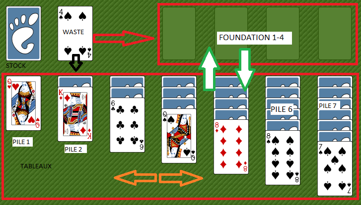

# klondike
Práctica sobre Rational Unified Procecss

# Domain Model

Para estudiar el modelo nos hemos basado en la documentación de la wiki (que no es todo lo clara que se podría esperar)
y en la imagen de una versión muy conocida:

Las fechas indican los movimientos que estan permitidos entre los distintos grupos de cartas.

Correspondiente a los distintos montones de cartas que intervienen en el juego hemos extraído el siguiente diagrama
de clases:

# Actors

# Use Cases

Los casos de uso que hemos detectado son los siguientes:

El siguiente diagrama muestra un diagrama de estado general:

## Priorización de casos de uso
    * Start
    * Stock to Waste
    * Waste to Pile
    * Waste to Fundation
    * Pile to Fundation
    * Pile to Pile
    * Fundation to Pile
    * Abort

## Descripción detallada de los casos de uso

